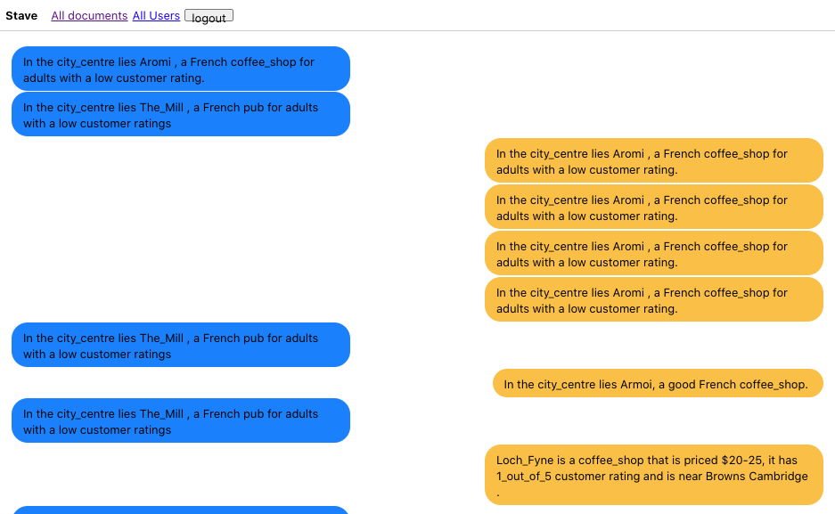

# Data-to-text Generation with Style Imitation

*Code to be further cleaned up soon...*

This repo contains the code of the following paper:

[Data-to-text Generation with Style Imitation](https://arxiv.org/abs/1901.09501)

*Shuai Lin, Wentao Wang, Zichao Yang, Xiaodan Liang, Eric P. Xing, Zhiting Hu.*    
*Findings of EMNLP 2020*  
## Requirements

The code has been tested on:
 - `Python 3.6.0 and Python 3.7.6`
 - `tensorflow-gpu==1.14.0`
 - `texar-tf==0.2.1`
 - `cuda 10.0`
 
** NOTE **: 
Due to some compatibility issues, the repo is only compatible by installing `texar==0.2.1` from source, which is as follows:
```bash
wget https://github.com/asyml/texar/archive/v0.2.1.zip
cd texar && pip install .
```
 
Run the following command:

```bash
pip3 install -r requirements.txt
```

### For IE scores

If you'd like to evaluate IE scores for the NBA dataset after training, you
 need to install Lua Torch, download the IE models from [here](https://drive.google.com/file/d/1hV8I9tvoL3943OqqPkLFIbTYfFSqsV1e/view?usp=sharing) and then unzip the files directly under the directory `data2text/`.


## Data Preparation

The dataset developed in the paper is in the [repo](https://github.com/ha-lins/DTG-SI-data). 
Clone the repo and move them into the current directory as:
```
git clone https://github.com/ha-lins/DTG-SI-data
cd text_content_manipulation/
mv nba_data/ ../nba_data
mv e2e_data/ ../e2e_data
```

## Training

For our model:

```bash
python3 main_ours.py --copy_x --rec_w 0.8 --coverage --exact_cover_w 2.5 --dataset [nba/e2e] --save_path [nba_ours/e2e_ours]
```

Where `[SAVE_PATH]` is the directory you'd like to store all the files related to your experiment, e.g. `my_expr`.

Note that the code will automatically restore from the previously saved latest checkpoint if it exists.

You can start Tensorboard in your working directory and watch the curves and `BLEU(y_gen, y')`.


For the AttnCopy-Seq2seq baseline:
```bash
python3 main_ours.py --copy_x --rec_w 0 --dataset [nba/e2e] --save_path [nba_s2s/e2e_s2s]
```

For the MAST baseline:
```bash
python3 main_baseline.py --bt_w 0.1 --dataset [nba/e2e] --save_path [nba_MAST/e2e_MAST]
```

For the AdvST baseline:
```bash
python3 main_baseline.py --bt_w 1 --adv_w 0.5 --dataset [nba/e2e] --save_path [nba_AdvST/e2e_AdvST]
```

## Evaluation

### IE scores for NBA dataset

To evaluate IE (Information Retrieval) scores for the NBA dataset, you can
 run the command line:

```bash
python3 ie.py --gold_file nba_data/gold.[STAGE].txt 
              --ref_file nba_data/nba.sent_ref.[STAGE].txt 
              [SAVE_PATH]/ckpt/hypo*.test.txt
```

where `[STAGE]` can be val or test depending on which stage you want
 to evaluate. The result will be dumped into `[SAVE_PATH]/ckpt/ie_results.[STAGE
 ].txt`, where the columns represents training steps, `BLEU(y_gen, y')`, IE
  precision, IE recall, simple precision and simple recall respectively.

### Content scores for E2E dataset

We evaluate content scores for E2E dataset via Bert classifier, which is
 adapted from [the Texar implementation of BERT](https://github.com/asyml/texar/tree/master/examples/bert#use-other-datasetstasks). 
In general, we simply concatenate each record (i.e., `x` or `x_e`) with `y
`, then classify whether `y` express the record and obtain the `Inc-New
` and `Exc-Old` respectively. To this end, we first construct the
  data in `../bert/E2E` to train the Bert classifier. 

#### Data processing
Run the following command to prepare data for Bert classifier:

```bash
python3 prepare_data.py --save_path [SAVE_PATH] --step [STEP]
[--max_seq_length=128]
[--vocab_file=bert_config/all.vocab.txt]
[--tfrecord_output_dir=bert/E2E] 
```
which processes the previous `[SAVE_PATH]/ckpt/hypos[STEP].valid.txt` into
 the format of `x | y` in `TFRecord` data files. Here:

* `max_seq_length`: The maxium length of sequence. This includes BERT special tokens that will be automatically added. Longer sequence will be trimmed.
* `vocab_file`: Path to a vocabary file used for tokenization. 
* `tfrecord_output_dir`: The output path where the resulting TFRecord files will be put in. Be default, it is set to `bert/E2E`.


#### Classify and evaluate
We provide a pretrained model of Bert classifier in the [link](https://drive.google.com/drive/folders/1jNaJ_R_f89G8xbAC8iwe49Yx_Z-LXr0i), which achieves
 92% accuracy on the test set. Make sure that the pretrained model is put into the `bert/classifier_ckpt/ckpt` directory. Before the evaluation for content fidelity, remember to modify the file name of `config_data.py` manually. Then, run the following command to restore and compute the two content scores:

```bash
cd bert/
python3 bert_classifier_main.py  --do_pred --config_data=config_data --checkpoint=classifier_ckpt/ckpt/model.ckpt-13625
[--output_dir=output_dir/]
```
The above command will print the two scores and the classification results
 are saved in `output/results_*.tsv`, where each line contains the predicted
  result for each instance.

# Demo

We provide a `content rewriter` demo based on our NLP toolkit [Forte](https://github.com/asyml/forte/tree/master/examples/content_rewriter), which can
 be visulized with [Stave](https://github.com/asyml/stave/blob/master/src/plugins/dialogue_box/READEME.md) as follows:
 
<p align="center">

</p>

## Note
The previous version of this work was named `Text Content Manipulation`. The data used by our previous version is in the [repo](https://github.com/ZhitingHu/text_content_manipulation).

# Citation
If you use this code and the datasets for you research, please cite our paper.
```
@inproceedings{lin-etal-2020-data,
    title = "Data-to-Text Generation with Style Imitation",
    author = "Lin, Shuai and Wang, Wentao and Yang, Zichao and Liang, Xiaodan and Xu, Frank F. and Xing, Eric and Hu, Zhiting",
    booktitle = "Findings of the ACL: EMNLP 2020",
    year = "2020",
    publisher = "Association for Computational Linguistics",
    url = "https://www.aclweb.org/anthology/2020.findings-emnlp.144",
    pages = "1589--1598"
}
```
